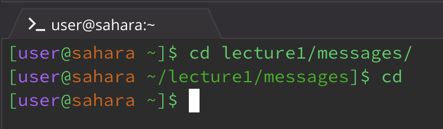
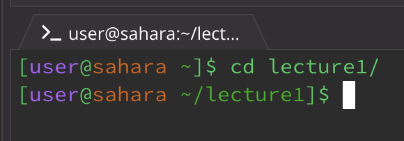
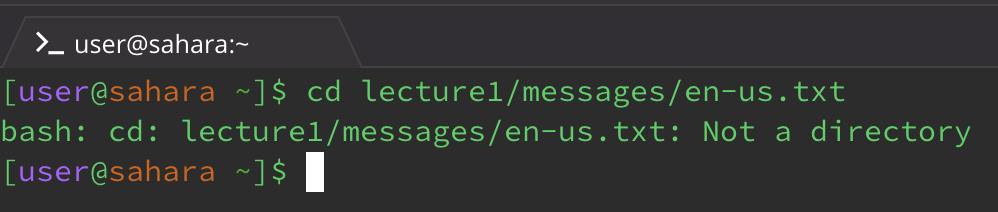
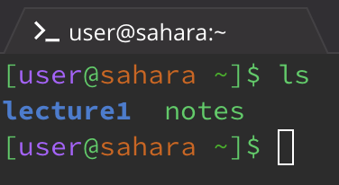
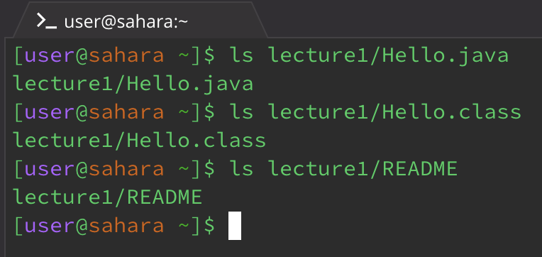
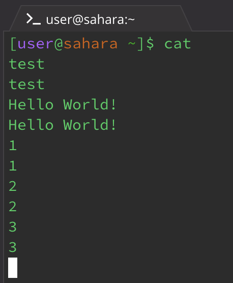
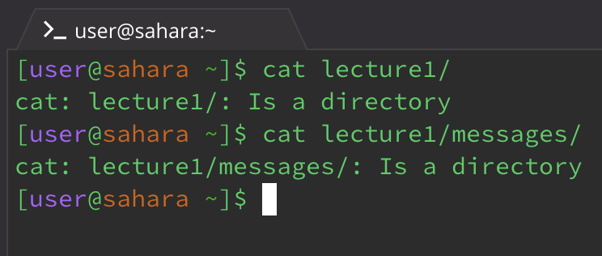
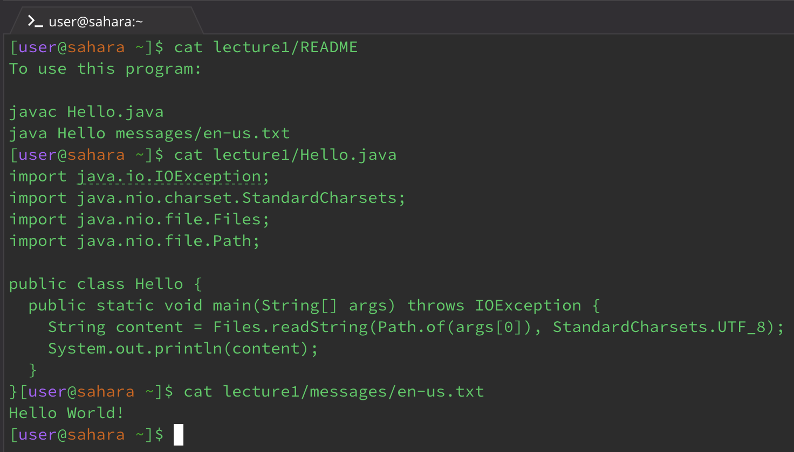

1. The command with no arguments
2. The command with a path to the directory as an argument
3. The command with a path to a file as an argument

The command `cd`

1. If you cd with no arugments it returns to the home directory

2. It goes into that directory

3. When you cd to a file it gives an error that it's not a directory

The command `ls`

1. It lists the files in the directory                

2. It lists the files in the specified directory

3. It just lists the path to the file

The command `cat`

1. With no arugments it repeats what the user types into the terminal

2. With a path to a directory, it states that path is a directory

3. With a path to a file, it prints the contents of the file

