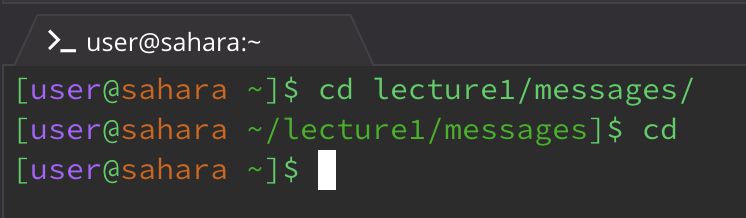
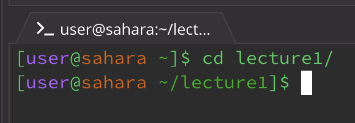
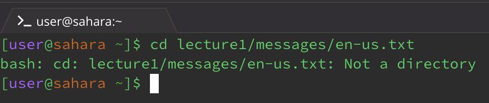
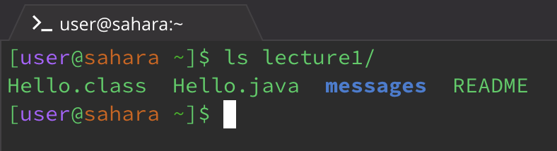
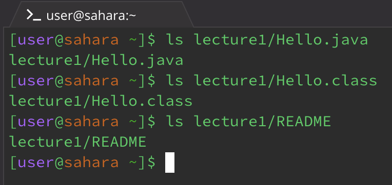
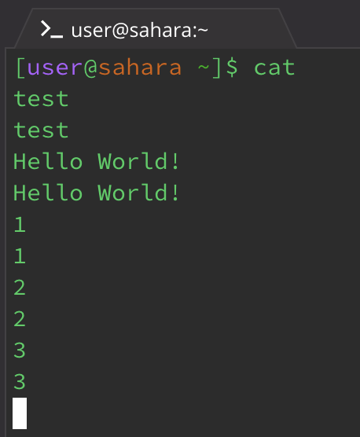
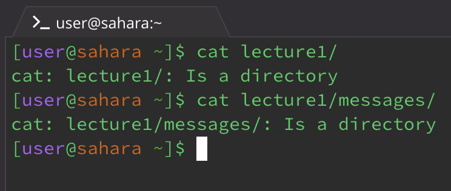
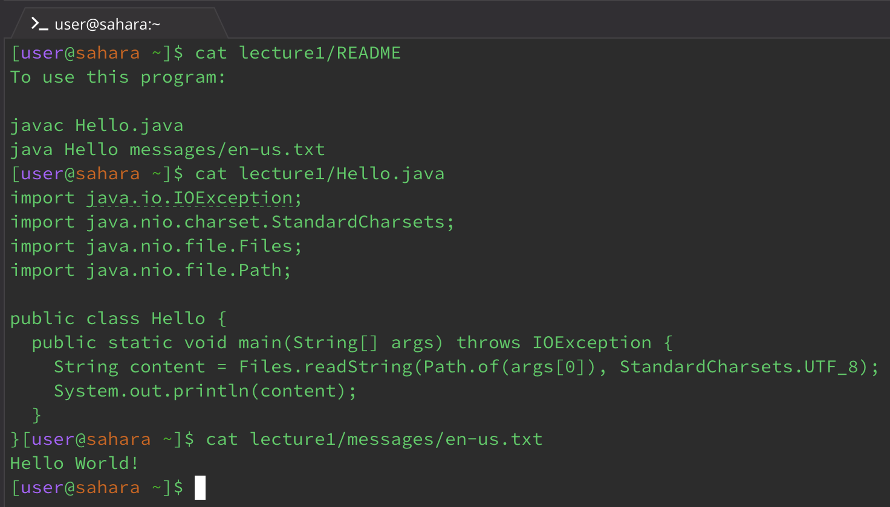

# Lab 1

1. The command with no arguments
2. The command with a path to the directory as an argument
3. The command with a path to a file as an argument

## The command `cd`

1. First I made my working directory in the messages folder (~/lecture1/messages/). If you cd with no arugments it returns to the home directory. This is not an error as it allows the user to use the cd command to quickly return to the home folder.

    
 
2. My working directory here is the home folder (~/). When running the command, it goes into that directory. This isn't an error as it changes directory into the specified folder.

    
 
3. My working directory is the home folder. It gives an error that it's "Not a directory" when you cd to a file.

    

## The command `ls`

1. The current working directory is home. When using ls with no arguments it lists the files in the directory. This is not an error because it prints what files are in the current directory.

    
 
2. The working directory is home. Using the command ls on a directory lists the files in the specified directory. This isn't an error because it shows what files are in the directory the user inputted.

    
 
3. My working directory here is home. When I use the command ls on a file, it just lists the path to the file. I believe this isn't an error because it tells the user where the file can be accessed.

    

## The command `cat`

1. The current working directory is home, with no arugments it repeats what the user types into the terminal. I think it is an error because it's not really functional, it just makes the user stuck until they press `ctrl + c` to exit.

    
 
2. My current directory is home. With a path to a directory, it states that path is a directory. This isn't an error because it correctly describes it as a directory.

    

3. The working directory is home. With a path to a file, it prints the contents of the file. This is not an error because it allows the user to see the contents of the file.

    
