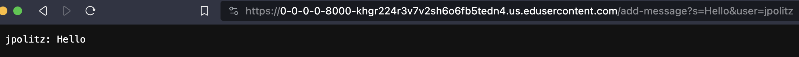
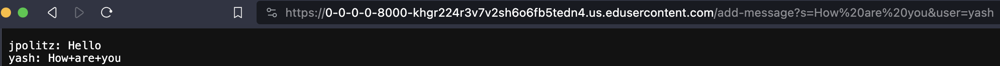
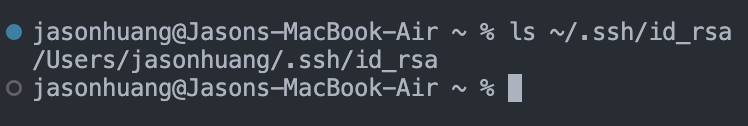
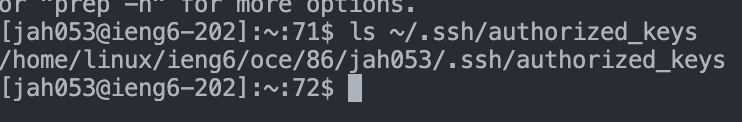
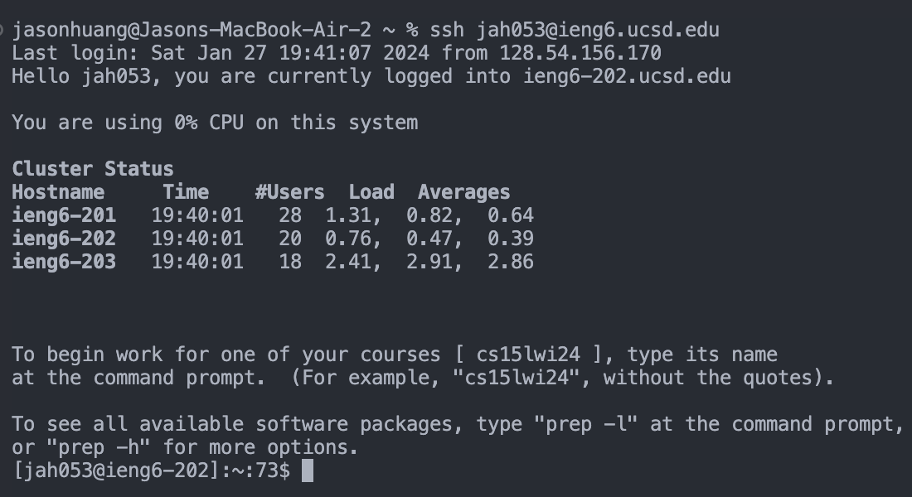

# Lab 2

## Part 1

### ChatServer.java
```
import java.io.IOException;
import java.net.URI;

class Handler implements URLHandler {
    String s = "";
    public String handleRequest(URI url) {
        if (url.getPath().contains("/add-message")) {
            String[] parameters = url.getQuery().split("=");
            if (parameters[0].equals("s")) {
                s += String.format(parameters[2] + ": " + parameters[1].substring(0, parameters[1].indexOf("&")) + "\n");
                return s;
            }
        }
        return " ";
    }

}

class ChatServer {
    public static void main(String[] args) throws IOException {
        if(args.length == 0){
            System.out.println("Missing port number! Try any number between 1024 to 49151");
            return;
        }

        int port = Integer.parseInt(args[0]);

        Server.start(port, new Handler());
    }
}
```




My `handleRequest` method is called. The relevant arugments to this method is `/add-message`, `s=`, and `user=`. `String s` is a relevant field whose value is an empty string. String s changes by adding the message in the formant `(user): (message)`. In this case it added `jpolitz: Hello` to string s.



The method `handleRequest` is called again. It has the same relevant arugments of `/add-message`, `s=` and `user=`. The relevant field is `String s`. String s has the value of the previously recorded message which is `jpolitz: Hello`. String s changes by adding the new message on a seperate line. Here it adds `yash: How+are+you` to string s.

## Part 2

The absolute path to the private key for SSH on my local computer:



`/Users/jasonhuang/.ssh/id_rsa`

The absolute path to the public key for SSH in ieng6:



`/home/linux/ieng6/oce/86/jah053/.ssh/authorized_keys`

Terminal interaction of login without the need for my password:



## Part 3 

One thing that I learned from lab in week 3 was that you are able to create a key so you can ssh without needing to type your password everytime. This is very nice as it save us time from always needing to type in our password.
