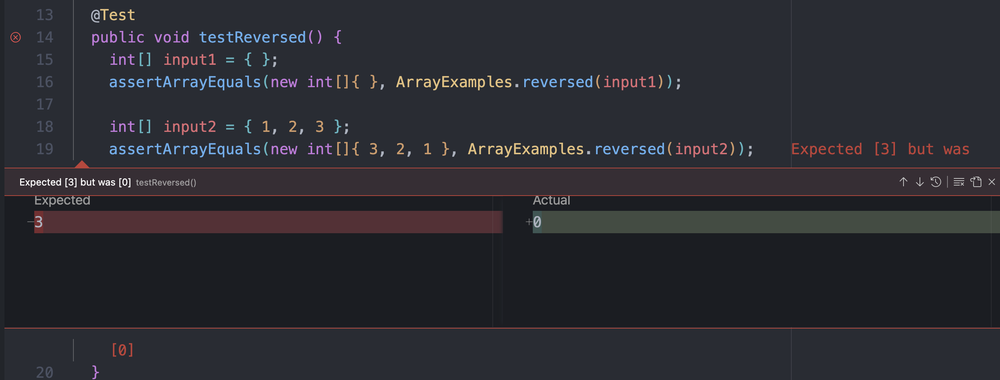

# Lab 3

## Part 1 - Bugs

The bug I am choosing is the reverse method. 

* A failure inducing input is { 1, 2, 3 }
```
  @Test
  public void testReversed() {
    int[] input2 = { 1, 2, 3 };
    assertArrayEquals(new int[] { 3, 2, 1 }, ArrayExamples.reversed(input2));
  }
```

* An input that doesn't induce an input is { }, an empty array.
```
  @Test
  public void testReversed() {
    int[] input1 = { };
    assertArrayEquals(new int[]{ }, ArrayExamples.reversed(input1));
  }
```

Note: I seperated the code but the original has both inputs, as seen below.
```
  @Test
  public void testReversed() {
    int[] input1 = { };
    assertArrayEquals(new int[]{ }, ArrayExamples.reversed(input1));

    int[] input2 = { 1, 2, 3};
    assertArrayEquals(new int[] { 3, 2, 1 }, ArrayExamples.reversed(input2));
  }
```

* The symptom is that it would return an array with zeros: { 0, 0, 0 }

   

* Before and after code to fix it

Before:
```
  static int[] reversed(int[] arr) {
    int[] newArray = new int[arr.length];
    for(int i = 0; i < arr.length; i += 1) {
      arr[i] = newArray[arr.length - i - 1];
    }
    return arr;
  }
```

After:
```
  static int[] reversed(int[] arr) {
    int[] newArray = new int[arr.length];
    for(int i = 0; i < arr.length; i += 1) {
        newArray[i] = arr[arr.length - i - 1];
    }
    return newArray;
  }
```
This fixes the issue because before it was taking the new array values which was all zeros and editing the original array to have those values. Now it takes the array values from the end of the original array and puts it at the beginning of the new array which reverses the elements.

## Part 2 - Commands

Note: I used `cd` to the `technical` directory.

I chose the command `find`.

* The first interesting command line option for `find` is `-empty`.
  One way to use `-empty` is to find empty directories. I created an empty folder called `empty folder` in `technical`. Then I ran the command `find . -type d -empty` to find empty directories. This is useful for when you want to check if any directories are empty before you add/move files into it.

```
technical $ find . -type d -empty
        ./empty folder
``` 

  Another way to use `-empty` is to find empty files. I created an empty text file in `technical/plos`. Then I ran the command `find . -type f -empty` to find all the empty files in the `technical` directory. This is useful if you want to find empty files and want to remove them.
```
technical $ find . -type d -empty
        ./plos/empty-file.txt
```

* The second interesting command line option is `-iname`.
  One way to use `-iname` is to find files by their approximate name. I created a `two` folder with the files `foo.txt`, `foo2.txt`, and `foobar.txt`. This is useful if you have files with similar names and want to find them.
```
technical $ find . -iname "*foo*txt"
        ./two/foo.txt
        ./two/foobar.txt
        ./two/foo2.txt
```

  Another way to to use it is if you have similar directory names. I created a `foo` directory and a `foobar` directory. This is useful if you have many directories with similar names and want to find all of them.
  ```
technical $ find . -type d -iname "*foo*"
        ./foobar
        ./foo
```

* The third command line option is `-name`.
  One way to use `-name` is to find files by it's name. In the `foo` directory I created a file called `very-specific.txt`. This is useful when you know the name of a file but not the exact location of it.
  ```
  technical $ find . -name "very-specific.txt`
          ./foo/very-specific.txt
  ```
