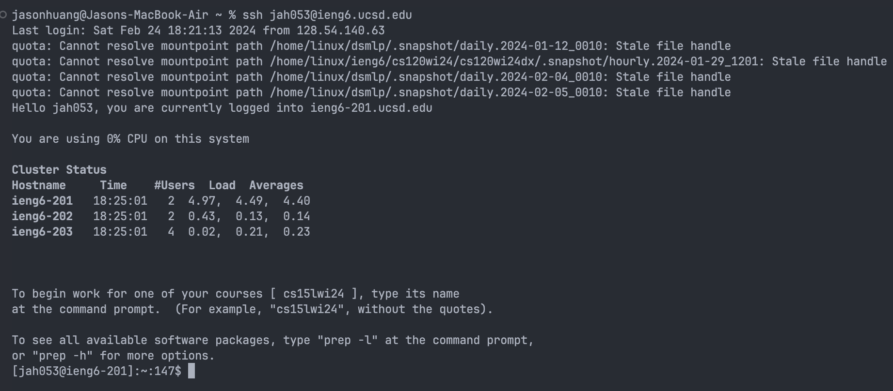
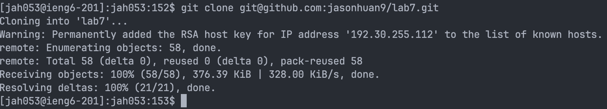
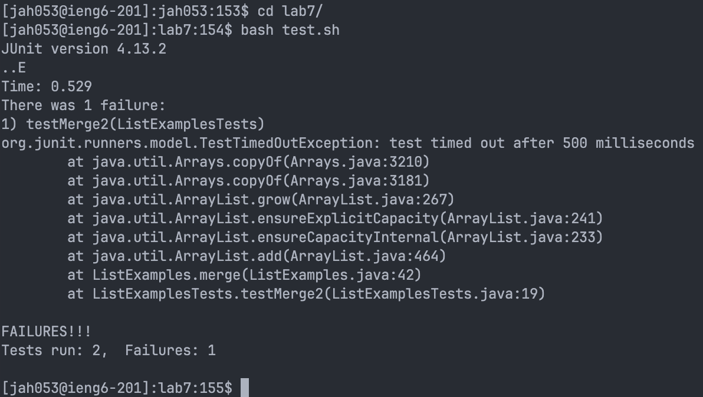
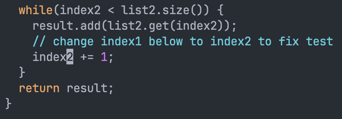
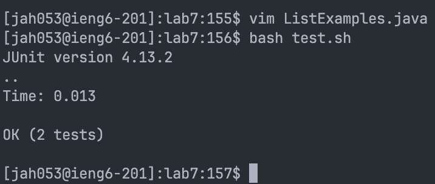
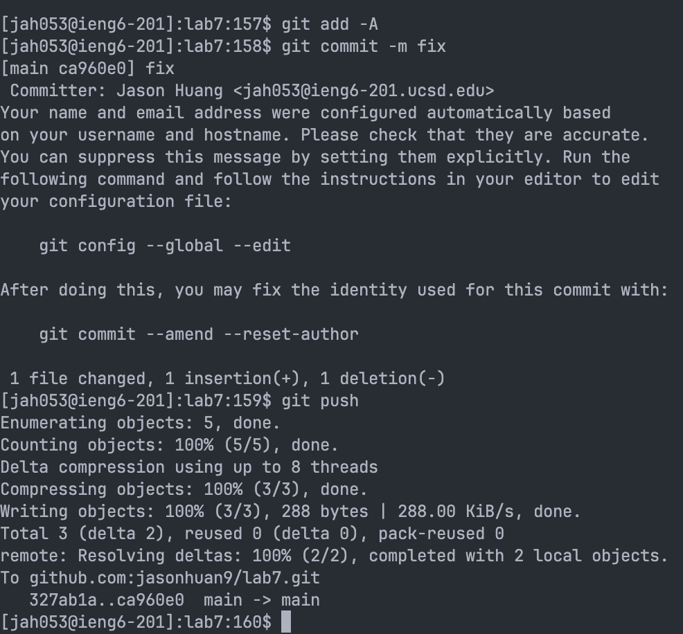

# Lab 4

## Log into ieng6

Keys pressed: `<up><enter>`, the command I ran was `ssh jah053@ieng6.ucsd.edu`, the command was 1 up in the history, so I used the up arrow to access it.

## Cloning my fork of the repository 

Keys pressed: `git clo <tab> <command>v <enter>`, the command I ran was `git clone git@github.com:jasonhuan9/lab7.git`, I copied the ssh url to my clipboard and pasted it after typing git clone.

## Run the test, showing that they fail

Keys pressed: `cd l <tab><enter>`, I ran `cd/lab7`. Then I pressed `bash t <tab><enter>` to run `bash test.sh`.

## Fix the code

Keys pressed: `vim L <tab> .j <tab><enter>`, to run `vim ListExamples.java` Then in vim, I pressed `43j e r2 :x` to change `index1` to `index2`.

## Run the test, showing that they pass

Keys pressed: `<up><up><enter>`, to run `bash test.sh`, the command was 2 up in my history.

## Commit and push the changes to Github

Keys pressed: `git add -A`, to add the files, then `git com<tab> -m fix` to commit the changes, and then `git push` to push the changes to Github.

