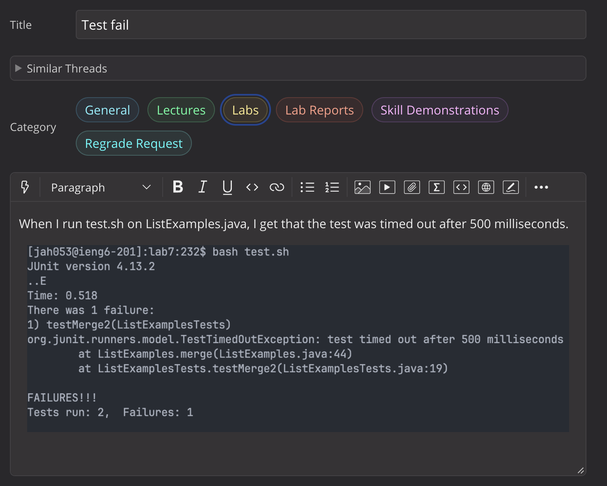
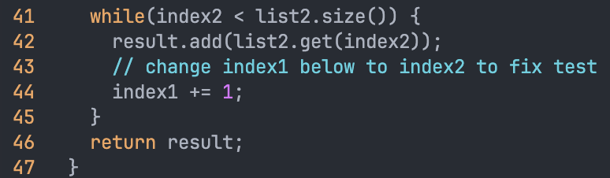
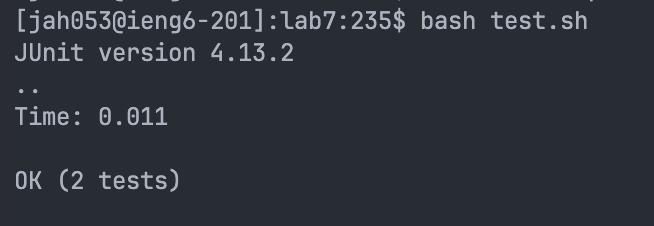

# Lab 5

## Debugging Scenario

Hi, looking at the output from the bash script, we can see that the error is on line 44 in ListExamples.java. Take a look at the code and see if you can figure out the issue.

Thank you for the reply, I used vim to see the code on line 44 and see that the issue was that `index1` was being incremented, not `index2`.

The files I used were from `https://github.com/ucsd-cse15l-s23/lab7` and I set it up by sshing into ieng6, then cloning it.

The contents of each file before fixing the bug is at `https://github.com/ucsd-cse15l-s23/lab7`.

The command I ran to trigger the bug was `bash test.sh`.

On line 44 in ListExamples.java, replace `index1` with `index2`.

## Reflection

Something I learned from lab in the second half of the quarter was vim and git. I like vim because if you learn it, you could become really quick and efficient at writing code or making quick edits to a file. I believe that learning git is very useful because it allows for collaboration on projects with others.
